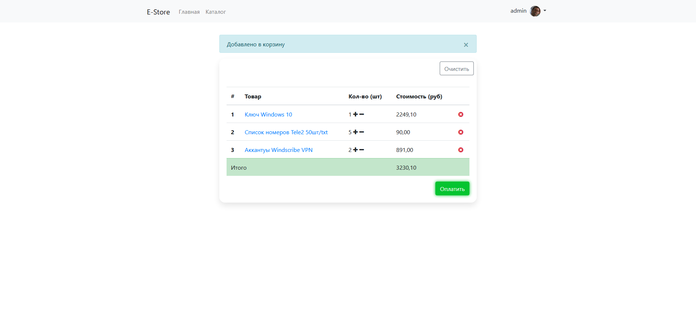

<h1 align="center">E-Store</h1>

------

## Описание

Магазин цифровых товаров

## Канбан доска проекта

## Live Demo

[Demo](https://estore-demo.herokuapp.com/)

### Данные для входа:

Login: test_account

Password: estoredemo

## Функционал

* Покупки
* Подписочная система для скидок
* Смена настроек
* Регистрация
* Авторизация
* Слияние корзины из сессии с БД
* Размещение промо-объявлений
* Отображение заказа(ов)
* Возможность скачать весь заказ

## To-Do

* SMTP-подтвеждение аккаунта
* Бонусная система
* Смена пароля

## Скриншоты

